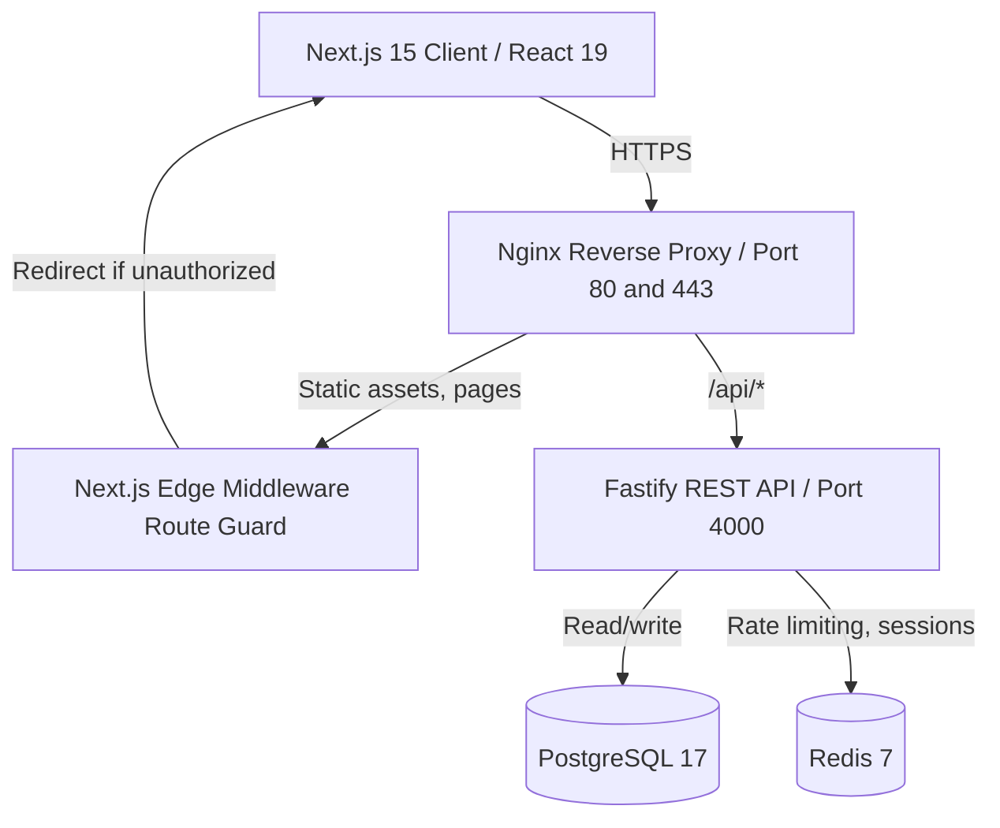

# Concentrate.ai Canvas-Style School Portal

Full-stack implementation of the Concentrate.ai hiring quiz (see [SPECS.md](./SPECS.md)): a Canvas-style school portal with Admin, Teacher, and Student roles, a rubric-based grading workflow, a school statistics API, and an AI chat assistant grounded in real account data.

## Architecture



**Frontend:** Next.js 15 (App Router), React 19, Tailwind CSS, Radix UI primitives, lucide-react icons.
**Backend:** Node.js, Fastify, TypeScript, Zod.
**Data:** PostgreSQL 17 via Kysely, Redis for caching and rate limiting.
**Testing:** Vitest, Testing Library, Playwright.
**Delivery:** GitHub Actions, Dockerfile, Docker Compose, nginx.

See [docs/ARCHITECTURE.md](./docs/ARCHITECTURE.md) for more detail.

## Authentication

JWT access/refresh tokens in httpOnly, `SameSite=Lax` cookies. Next.js edge middleware gates routes by role before the page renders; every backend route is independently checked server-side via `authenticate` + `requireRole` hooks, so a client bypassing the UI still can't reach data it shouldn't. Google OAuth is supported alongside email/password login; a bare Google sign-up defers role/school selection to a `/complete-profile` step before the dashboard is reachable.

## Database

Migrations are plain TypeScript, run via Kysely, in `src/server/db/migrations/`.

| Table | Notes |
|---|---|
| `users` | `role` enum (admin/teacher/student), `school_id`, `is_suspended` |
| `schools` | multi-tenant boundary |
| `classes` | owned by a teacher, scoped to a school, unique enrollment `code` |
| `student_enrollments` | join table, `status` (active/dropped) |
| `assignments` | rubric stored as JSONB |
| `submissions` | student deliverables (text or file) |
| `grades` | rubric scores + feedback, linked to a submission |
| `teacher_groups` | admin-managed teacher groupings |
| `syllabus_weeks` / `class_announcements` | teacher-editable per-class content |

## School Statistics API

Exposed under `/api/v0/stats`, authenticated:

| Endpoint | Method | Returns |
|---|---|---|
| `/api/v0/stats/average-grades` | GET | Average grade across all classes |
| `/api/v0/stats/average-grades/:id` | GET | Average grade for one class |
| `/api/v0/stats/teacher-names` | GET | All teacher names |
| `/api/v0/stats/student-names` | GET | All student names |
| `/api/v0/stats/classes` | GET | All classes |
| `/api/v0/stats/classes/:id` | GET | Students enrolled in one class |

## Local Setup

Requires Node.js >= 20, npm >= 10, Docker and Docker Compose.

```bash
npm install
cp .env.example .env
docker compose up -d postgres redis
npm run db:migrate
npm run dev
```

Frontend at `http://localhost:3000`, API at `http://localhost:4000` (proxied through the frontend in dev via Next.js rewrites).

Populate `GOOGLE_CLIENT_ID` / `GOOGLE_CLIENT_SECRET` in `.env` to enable Google sign-in, and `AI_API_KEY` to enable the live chat assistant (it falls back to a deterministic mock stream if unset, so the app runs fully without one).

## Testing

```bash
npm run lint          # ESLint
npm run test           # Vitest: unit + integration (Fastify's app.inject(), not a separate HTTP client)
npm run coverage       # Vitest with coverage - 100% thresholds enforced (lines/statements/branches/functions)
npx playwright install # first run only
npm run test:e2e       # Playwright end-to-end specs
```

## Deployment

```bash
npm run build
docker compose up -d --build
docker compose exec app npm run db:migrate
```

`docker-compose.yml` runs the app, Postgres, Redis, and an nginx reverse proxy. For a cloud VM: point DNS at the host, install Docker, use Certbot for a TLS certificate, and mount it where `nginx/nginx.conf` expects it. See [docs/DEPLOYMENT.md](./docs/DEPLOYMENT.md).

## Seeded accounts

| Role | Email | Password |
|---|---|---|
| Admin | `sarah.chen@university.edu` | `AdminPass123!` |
| Teacher | `alice.thompson@university.edu` | `TeacherPass123!` |
| Student | `alex.johnson@university.edu` | `StudentPass123!` |
